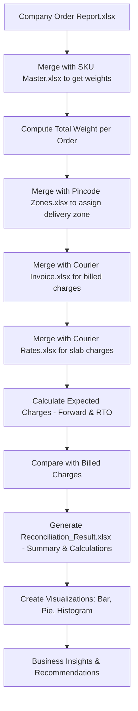

# Courier Cost Analyzer

A Python-based data pipeline that reconciles courier invoices against company order records to detect overcharges and undercharges.

## Features

• Automated reconciliation of courier bills with internal records
• Weight slab calculation and charge validation
• Summary table for correct, overcharged, and undercharged orders
• Excel report generation with detailed calculations
• Business insights and visualizations (bar, pie, histogram)

## Architecture

The system integrates multiple Excel files:
1. Company Order Report (SKU, quantity)
2. SKU Master (product weights)
3. Pincode Zones (delivery mapping)
4. Courier Invoice (billed charges)
5. Courier Rates (zone-wise slab charges)
The pipeline merges these datasets, applies weight slab rounding logic, computes expected charges, compares them with billed charges, and generates reports + visual insights.

## Workflow

## Setup

1. Clone repository
2. Place all Excel input files in the 'Data/' folder
3. Install dependencies: pip install -r requirements.txt
4. Run analysis.py in VS Code or terminal
5. Outputs: Reconciliation_Result.xlsx, summary_bar.png, summary_pie.png, diff_hist.png

## Usage

Run: python analysis.py
This generates a detailed reconciliation report and visualizations.

## Input Files

Company X - Order Report.xlsx, Company X - SKU Master.xlsx, Company X - Pincode Zones.xlsx, Courier Company - Invoice.xlsx, Courier Company - Rates.xlsx

## Output Files

Reconciliation_Result.xlsx (summary + calculations), summary_bar.png, summary_pie.png, diff_hist.png

## Dependencies

pandas, numpy, matplotlib, xlsxwriter

## Business Insights

Identify correctly charged orders, detect overcharges for potential recovery, track undercharges for consistency monitoring, and generate actionable recommendations.

## License

This project is for internal business use.
